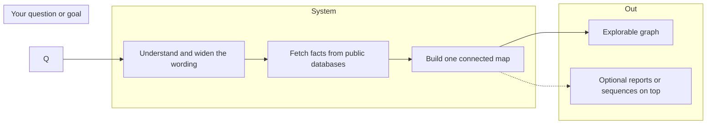
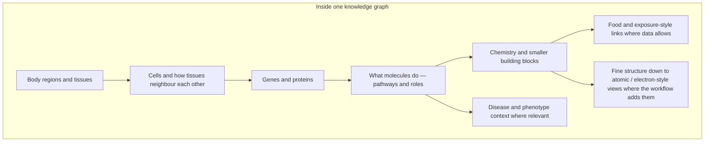
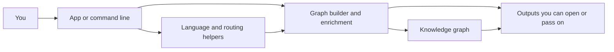
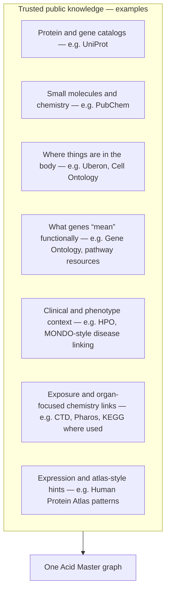

# Acid Master

## Why this exists: artificial food prediction

The **primary goal** is **artificial food prediction** — supporting safer, better-informed choices about what we eat and how it meets the body. The system does not invent nutrition facts. It **connects** what is already known in public science: how organs, tissues, genes, proteins, small molecules, pathways, and real foods relate in the same living picture. That single connected map is the foundation for reasoning about food, biology, and health together instead of in separate boxes.

---

## What you get in one sentence

You describe what you care about in ordinary language. The system builds a **large, trustworthy link map** (a knowledge graph) so you can see **substances and relationships** — not just isolated lists — across biology, chemistry, nutrition, and related clinical context.

---

## How the journey works (no code required)

The picture below is the same story as the old “pipeline” chart: from your question, through enrichment steps, into one shared network.



---

## What sits inside the map

Think of **layers** of the same world: core biology, structure, chemistry, function, clinical hints, the outside world (including food), and fine-grained physical detail. Everything still lives in **one** graph so paths between ideas stay visible.



---

## How the software pieces fit together

You interact at the front; services and helpers run in the middle; you receive a **case-style bundle** and the **living graph** as outputs.



---

## In plain words

1. **You say what you want** in everyday language (including angles that matter for food and the body).
2. **The system rephrases and expands** a little so obvious angles are not missed.
3. **It pulls real records** from large public biology and chemistry sources — not invented facts.
4. **It turns that into a map**: things become **points**, supported relationships become **connections**.
5. **You can ask for the graph alone** and get the full network in one go when that is all you need.

**Artificial food prediction** benefits when this map ties **food-relevant chemistry and biology** to **where and how** the body uses or processes them, so decisions rest on linked evidence rather than single headlines.

---

## Ways to use it

| You choose | You get |
|------------|---------|
| The usual “generate sequence” style run | A run that includes the graph among other outputs |
| **solo** | The full graph only — all nodes and connections in one payload |

---

## Where the facts come from

Public resources feed the **same** map (names below are for recognition; the project wires many of them in its enrichment steps):



Nothing here replaces a doctor or a dietitian. It is a **research and exploration** tool built on **open data** and clear linking.

---

## For people who will run it themselves

```bash
pip install -r requirements.txt
python server.py
```

### Tests (CI-friendly minimal install)

The test suite avoids importing the FastMCP server so it runs on a small dependency set
(use Python 3.10+ for the MCP server itself; tests run on 3.9+ with pytest only).

```bash
pip install -r requirements-test.txt
python -m pytest tests/ -v
```

Full local environment including the scientific stack:

```bash
pip install -r requirements-dev.txt
python -m pytest tests/ -v
```

### Live MCP client (``generation`` tool over SSE)

The server entrypoint is ``server.py`` (Dockerfile exposes **8000**). With the container
or process listening on the host port, run the hardcoded SSE client (same URL as
``http://127.0.0.1:8000/sse`` by default):

```bash
pip install -r requirements-e2e.txt
# FastMCP needs Python 3.10+ (on Windows: py -3.11 …)
python tests/test_mcp_generation_sse_client.py
```

Pytest variant (still hits the real network and full generation pipeline):

```bash
ACID_MASTER_E2E=1 pytest tests/test_mcp_generation_sse_client.py -m integration -v
```

Override URL or timeout if needed: ``ACID_MASTER_SSE_URL``, ``ACID_MASTER_TOOL_TIMEOUT_SEC``.

E2E responses are written under ``tests/out-dir/`` (``run_summary.json`` plus per-case JSON).
Set ``ACID_MASTER_E2E_OUT_DIR`` to use a different directory.

Run logs go under ``tests/logs/`` (override ``ACID_MASTER_E2E_LOG_DIR``). Retries:
``ACID_MASTER_E2E_CASE_ATTEMPTS`` (default 4), ``ACID_MASTER_E2E_RUN_PASSES`` (default 3),
``ACID_MASTER_E2E_RETRY_BASE_SEC`` (default 15).

Optional: bind address and log level for the MCP server:

- `ACID_MASTER_HOST` (default `0.0.0.0`)
- `ACID_MASTER_PORT` (default `8000`)
- `LOG_LEVEL` (default `INFO`)

With Docker:

```bash
docker build -t acid-master .
docker run -e GEMINI_API_KEY=your_key -p 8000:8000 acid-master
```

Command line only:

```bash
python main.py
```

Put your Google Gemini key in a `.env` file (or pass it in Docker) so scoring, routing, and graph-related language features can run:

```
GEMINI_API_KEY=your_key_here
```

---

## Roadmap notes

### Server
- Classification of tissue and component classification
- Tissue ontology mapping to AOMAR electron matrices
