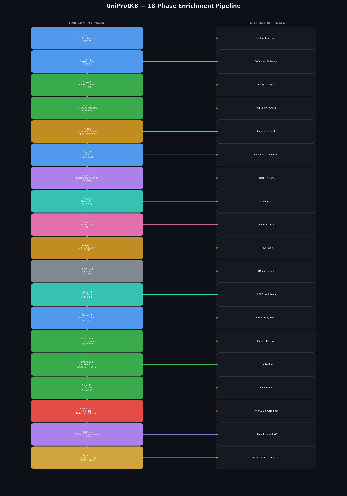
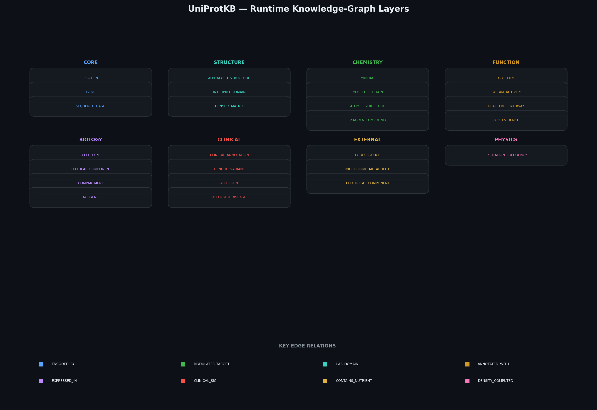
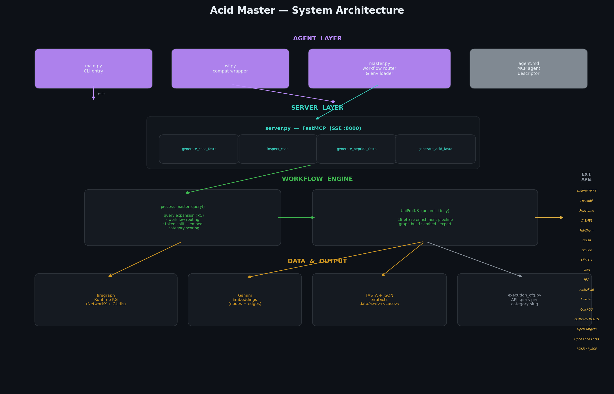

# Acid Master

**What you get:** one big connected map — a **knowledge graph** — that pulls together proteins, genes, drugs, foods, cells, pathways, and many other biological “substances” from trusted public sources. Everything is linked so you can see how the pieces relate, not just a flat list.

Your question helps the system decide what to emphasise. The heart of the project is still that **single graph**: all those ingredients, woven into one explorable structure.

---

## Picture the pipeline

This chart is the journey from raw data sources into the enrichment steps that fill the graph. You do not need to read every box — it simply shows *how much* flows into the same network.



---

## Picture what sits inside the graph

Different **layers** in the map group similar kinds of things: core biology, structure, chemistry, function, clinical clues, the outside world (food, microbiome), and even light-related physics at the finest level. Again, the point is one shared world, not separate silos.



---

## Picture how the pieces of the software fit together

If you like a simple “who talks to whom” view: you ask something, helpers and services work in the background, and out comes your case folder plus that living graph.



---

## In plain words

1. **You describe what you want** in everyday language (for example: a peptide angle or an amino-acid style goal).
2. **The system widens your wording** a few ways so nothing obvious is missed when it searches.
3. **It gathers real records** from large public biology and chemistry databases — not made-up facts.
4. **It builds the graph**: those substances and ideas become **dots**, and real relationships become **lines** between them.
5. **You can also ask only for the graph** (nothing else) and receive the full network ready to use or inspect.

So: **substances and relationships from many domains → one graph.** Sequences and other outputs are optional extras built on top of that same picture.

---

## Ways to use it

| You call | You get |
|----------|---------|
| The usual “generate sequence” style tools | A run that includes the graph among other outputs |
| **solo** | The full graph only — all nodes and connections in one payload |

---

## Run it

```bash
pip install -r requirements.txt
python server.py
```

With Docker:

```bash
docker build -t acid-master .
docker run -e GEMINI_API_KEY=your_key -p 8000:8000 acid-master
```

Command line only:

```bash
python main.py
```

---

## One key

Put your Google Gemini key in a `.env` file (or pass it in Docker) so scoring, routing, and graph smarts can run:

```
GEMINI_API_KEY=your_key_here
```

---

## Where the facts come from

The graph is filled from many well-known open resources (protein catalogs, drug and small-molecule data, nutrition, genomics, pathways, cell atlases, structure predictions, and more). They all feed the **same** map — that is the point of Acid Master.
